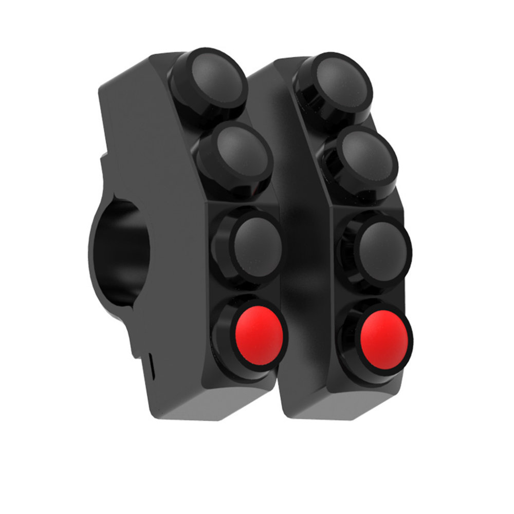

# u701 

## Introduction

**u701** is a Rust and C++ based BLE proxy for the Terrain Command controller, designed to remap BLE events to be compatible with iOS devices. Originally supporting only Android, this implementation extends functionality to iOS, running on an ESP32C3 microcontroller.

## Event Mapping Flow

Events from the Terrain Command are remapped as follows:

1. Terrain Command sends a BLE event.
2. ESP32 (running this software) receives and remaps the event.
3. Remapped BLE event is transmitted to the connected iPhone.

The ESP32 acts simultaneously as a BLE host and server.

## Features
- **Direct Button Mapping**: Buttons can be mapped directly to HID events like Play/Pause.
- **Meta Key Combinations**: Utilize the red Meta keys on the controller for complex commands.
- **iOS Shortcuts Integration**: Events can trigger iOS shortcuts for extended functionality.

## Terrain Command Button Layout
The Terrain Command controller features 8 buttons:
- **Top Row**: `M1`, `M2` (Red) - Meta keys.
- **Middle Rows**: `A2`, `B2` | `A3`, `B3` (Black and Blue).
- **Bottom Row**: `A4`, `B4` (Black).

## Meta Keys
The Meta keys (`M1` and `M2`) can be combined with other buttons to trigger unique BLE events:
1. Press and release a Meta key.
2. Press another key to trigger the event.

### Current Mappings
#### M1 Combinations
- `A2`: Shortcut A
- `A3`: Shortcut B
- (Other mappings to be filled in)

#### M2 Combinations
- `A2`: Shortcut G
- `A3`: Shortcut H
- (Other mappings to be filled in)

## Shortcuts
To map a key combination to an iOS shortcut:
1. Create a shortcut in the iOS Shortcuts app.
2. Go to Settings -> Accessibility -> Keyboards -> Commands in iPhone.
3. Scroll to the bottom, select the created shortcut, and press the key combination (e.g., `M1` + `A3`) on the Terrain Controller.

## HID Events
Pre-configured HID events:
- `A2`: Volume Down
- `A3`: Previous Song
- `A4`: Play/Pause
- `B2`: Volume Up
- `B3`: Next Song
- `B4`: Eject (toggles keyboard visibility in iOS)

## Custom Events
Modify mappings in `machine/src/constants.rs` to add custom events.

## Hardware Support
- Terrain Command v2
- ESP32C3
(For Terrain Command V3, update event IDs in `machine/src/constants.rs`.)

## Flashing the ESP32
Use the command `just upload monitor`.

## About
This project implements a BLE proxy using ESP32C3, Platformio, Rust, and several Arduino libraries. (Libraries to be detailed further)

## Setup
Set the correct build target for the ESP32: `rustup target add riscv32imc-esp-espidf`

## Development Tools
The project uses `just` as a build system. The `Justfile` contains commands for interacting with the ESP32. (Detailed explanations of these commands are pending.)

## Goal
- Transition entirely to Rust, eliminating Platformio and C++.
- Address reconnecting issues when using plain Rust.
